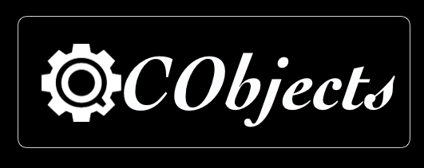

   logo

QCObjects
=========

Copyright (c) Jean Machuca and QuickCorp info@quickcorp.cl

See a demo using Foundation components here:
https://github.com/QuickCorp/quickobjects_sample1foundation

Please fork this project or make a link to this project into your
README.md file. Read the LICENSE.txt file before you use this code.

Cross Browser Javascript Framework for MVC Patterns
===================================================

QCObjects is a javascript framework designed to make easier everything
about the MVC patterns implementation into the pure javascript scope.
You don’t need to use typescript nor any transpiler to run QCObjects. It
runs directly on the browser and it uses pure javascript with no extra
dependencies of code. You can make your own components expressed in real
native javascript objects or extend a native DOM object to use in your
own way. You can also use QCObjects in conjunction with CSS3 frameworks
like [Foundation] (https://foundation.zurb.com), [Bootstrap]
(http://getbootstrap.com) and mobile javascript frameworks like
[PhoneGap] (https://phonegap.com) and OnsenUI (https://onsen.io)

If you like this code please
`DONATE <https://www.paypal.com/cgi-bin/webscr?cmd=_s-xclick&hosted_button_id=UUTDBUQHCS4PU&source=url>`__!

If you like more code samples feel free to write your questions to
info@quickcorp.cl

Installing with NPM:
====================

.. code:: shell

    > npm install qcobjects

Using the code in the straight way into HTML5:
==============================================

.. code:: html

    <script type="text/javascript" src="https://quickcorp.github.io/QCObjects/QCObjects.js"></script>

Step 1: Start creating a main import file and name it like: cl.quickcorp.js. Put it into packages/js/ file directory.
=====================================================================================================================

.. code:: javascript

    "use strict";
    /*
    * QuickCorp/QCObjects is licensed under the
    * GNU Lesser General Public License v3.0
    * [LICENSE] (https://github.com/QuickCorp/QCObjects/blob/master/LICENSE.txt)
    *
    * Permissions of this copyleft license are conditioned on making available
    * complete source code of licensed works and modifications under the same
    * license or the GNU GPLv3. Copyright and license notices must be preserved.
    * Contributors provide an express grant of patent rights. However, a larger
    * work using the licensed work through interfaces provided by the licensed
    * work may be distributed under different terms and without source code for
    * the larger work.
    *
    * Copyright (C) 2015 Jean Machuca,<correojean@gmail.com>
    *
    * Everyone is permitted to copy and distribute verbatim copies of this
    * license document, but changing it is not allowed.
    */


    Import ('external/libs');
    Import ('cl.quickcorp.model');
    Import ('cl.quickcorp.components');
    Import ('cl.quickcorp.controller');
    Import ('cl.quickcorp.view');

    Package('cl.quickcorp',[
      Class('FormValidator',Object,{

      }),
    ]);

Step 2: Then create some services inhereting classes into the file js/packages/cl.quickcorp.services.js :
=========================================================================================================

.. code:: javascript

    "use strict";
    /*
    * QuickCorp/QCObjects is licensed under the
    * GNU Lesser General Public License v3.0
    * [LICENSE] (https://github.com/QuickCorp/QCObjects/blob/master/LICENSE.txt)
    *
    * Permissions of this copyleft license are conditioned on making available
    * complete source code of licensed works and modifications under the same
    * license or the GNU GPLv3. Copyright and license notices must be preserved.
    * Contributors provide an express grant of patent rights. However, a larger
    * work using the licensed work through interfaces provided by the licensed
    * work may be distributed under different terms and without source code for
    * the larger work.
    *
    * Copyright (C) 2015 Jean Machuca,<correojean@gmail.com>
    *
    * Everyone is permitted to copy and distribute verbatim copies of this
    * license document, but changing it is not allowed.
    */


    Package('cl.quickcorp.service',[
      Class('JsonService',{
        method:"GET",
        cached:false,
        headers: {
            "Content-Type":"application/json",
          "charset":"utf-8"
        },
        JSONresponse: null,
        done:function(result){
          console.log("***** RECEIVED RESPONSE:");
          console.log(result.service.template);
          this.JSONresponse = JSON.parse(result.service.template);
          alert(this.template);
        }
      }),
      Class('FormSubmitService',{
        method:"POST",
        cached:false,
        headers: {
          "Content-Type":"application/json"
        },
        JSONresponse: null,
        done: function(result) {
          console.log("***** CALLED FormSubmitService");
          this.JSONresponse = JSON.parse(result.service.template);
          //TODO success case
          console.log("***** SUCCESS!")
          console.log(this.JSONresponse);
        },
        fail: function(result) {
          //TODO negative case
          console.log("***** ERROR");
        }

      })

    ])

Step 3: Now it’s time to create the components (cl.quickcorp.components.js)
===========================================================================

.. code:: javascript

    "use strict";
    /*
    * QuickCorp/QCObjects is licensed under the
    * GNU Lesser General Public License v3.0
    * [LICENSE] (https://github.com/QuickCorp/QCObjects/blob/master/LICENSE.txt)
    *
    * Permissions of this copyleft license are conditioned on making available
    * complete source code of licensed works and modifications under the same
    * license or the GNU GPLv3. Copyright and license notices must be preserved.
    * Contributors provide an express grant of patent rights. However, a larger
    * work using the licensed work through interfaces provided by the licensed
    * work may be distributed under different terms and without source code for
    * the larger work.
    *
    * Copyright (C) 2015 Jean Machuca,<correojean@gmail.com>
    *
    * Everyone is permitted to copy and distribute verbatim copies of this
    * license document, but changing it is not allowed.
    */
    Package('cl.quickcorp.components',[
      Class('FormField',Component,{
        cached:false,
        reload:true,
        createBindingEvents:function (){
            var _executeBinding = this.executeBinding;
            var thisobj = this;
            var _objList = this.body.querySelectorAll(this.fieldType);
            for (var _datak=0;_datak<_objList.length;_datak++){
                var _obj = _objList[_datak];
                _obj.addEventListener('change',function(e){
                    logger.debug('Executing change event binding');
                    thisobj.executeBindings();
                });
                _obj.addEventListener('keydown',function(e){
                    logger.debug('Executing keydown event binding');
                        thisobj.executeBindings();
                });
            }
        },
        executeBinding:function (_obj){
            var _datamodel = _obj.getAttribute('data-field');
            logger.debug('Binding '+_datamodel+' for '+this.name);
            this.data[_datamodel]=_obj.value;
        },
        executeBindings:function (){
          var _objList = this.body.querySelectorAll(this.fieldType);
            for (var _datak=0;_datak<_objList.length;_datak++){
                var _obj = _objList[_datak];
                var _datamodel = _obj.getAttribute('data-field');
            logger.debug('Binding '+_datamodel+' for '+this.name);
                this.data[_datamodel]=_obj.value;
            }
        },
        done:function (){
          var thisobj = this;
          thisobj.executeBindings();
            thisobj.createBindingEvents();
          logger.debug('Field loaded: '+thisobj.fieldType+'[name='+thisobj.name+']');
        }
      }),
      Class('ButtonField',FormField,{
        fieldType:'button'
      }),
      Class('InputField',FormField,{
        fieldType:'input'
      }),
      Class('TextField',FormField,{
        fieldType:'textarea'
      }),
      Class('EmailField',FormField,{
        fieldType:'input'
      })
    ]);

Step 4: Once you have done the above components declaration, you will now want to code your controllers (cl.quickcorp.controller.js)
====================================================================================================================================

.. code:: javascript

    "use strict";
    /*
    * QuickCorp/QCObjects is licensed under the
    * GNU Lesser General Public License v3.0
    * [LICENSE] (https://github.com/QuickCorp/QCObjects/blob/master/LICENSE.txt)
    *
    * Permissions of this copyleft license are conditioned on making available
    * complete source code of licensed works and modifications under the same
    * license or the GNU GPLv3. Copyright and license notices must be preserved.
    * Contributors provide an express grant of patent rights. However, a larger
    * work using the licensed work through interfaces provided by the licensed
    * work may be distributed under different terms and without source code for
    * the larger work.
    *
    * Copyright (C) 2015 Jean Machuca,<correojean@gmail.com>
    *
    * Everyone is permitted to copy and distribute verbatim copies of this
    * license document, but changing it is not allowed.
    */
    "use strict";
    Package('cl.quickcorp.controller',[
        Class('MainController',Object,{
            _new_:function (){
                //TODO: Implement
                logger.debug('MainController Element Initialized');
            }
        }),
        Class('MyAccountController',Object,{
            component: null,
            done:function (){
                var controller = this;


                logger.debug('MyAccountController Element Initialized');
                this.component.body.setAttribute('loaded',true);

            },
            _new_:function (o){
                //TODO: Implement
                this.component = o.component;

            }
        }),
    ]);

# Step 5: To use into the HTML5 code you only need to do some settings
between

.. raw:: html

   <script> tags:

   ```html
   <script>
   CONFIG.set('relativeImportPath','js/packages/');
   CONFIG.set('componentsBasePath','templates/components/');
   CONFIG.set('delayForReady',1); // delay to wait before executing the first ready event, it includes imports
   CONFIG.set('preserveComponentBodyTag',false); // don't use <componentBody></componentBody> tag

   Import('cl.quickcorp'); # this will import your main file: cl.quickcorp.js into js/packages/ file path
   </script>

\``\`

Demo example: The simpliest demo example:
=========================================

.. code:: html

    <!DOCTYPE html>
    <html>
        <head>
            <title>Demo</title>
            <script type="text/javascript" src="QCObjects.js"></script>
            <script type="text/javascript">
                var canvas1,canvas2,canvas3,container;
            CONFIG.set('relativeImportPath','src/');

                /**
                 * Main import sentence.
                 */
                Import('cl.quickcorp',function (){

                    /**
                     * Super Container MyOwnBody
                     */
                    Class('MyOwnBody',HTMLBodyElement,{
                        customAttr:'custom',
                        body:document.body  // breakes default body element and replace with them
                    });

                    /**
                     * Another custom class definition
                     */
                    Class('MyContainer',HTMLElement,{
                        width:400,
                        height:400,
                        customAttr:'custom attr container'
                    });


                    /**
                     * Another custom class definition
                     */
                    Class('canvas',HTMLCanvasElement,{
                        customAttr:'custom'
                    });

                    /**
                     * Another custom class definition
                     */
                    Class('MyCanvas2',HTMLCanvasElement,{});

                    body = New(MyOwnBody); // binds to body
                    body.css({backgroundColor:'#ccc'});

                    container = document.getElementsByTagName('container')[0].Cast(MyContainer); // cast any javascript dom object to QC_Object class
                    container.css({backgroundColor:'red'}); // access binding in two directions to dom objects

                    /**
                     * Instance a new custom canvas
                     */
                    canvas1 = New(canvas,{
                width:100,
                height:100,
              });
                    canvas2 = New(canvas,{
                width:200,
                        height:100,
              });
                    canvas3 = New(canvas,{
                width:300,
                        height:50,
              });

                    canvas1.css({backgroundColor:'#000000'}); // like jquery and another style access
              canvas1.body.style.backgroundColor='#000000'; // standard javascript style access
                    canvas2.body.style.backgroundColor='#0044AA'; // standard javascript style access
                    canvas3.body.style.backgroundColor='green'; // standard javascript style access

                    canvas1.append(); //append canvas1 to body
                    canvas2.attachIn('container'); // attach or append to specific tag containers
                    container.append(canvas3); // append canvas3 to custom tag binding

    //              canvas1.body.remove(); // remove canvas1 from dom
                    body.append(canvas3); // append canvas3 to body

              // using components
              var c1 = New(Component,{'templateURI':'templatesample.html',cached:false});
              document.body.append(c1); // appends the c1 to the body


                });

            </script>
        </head>
        <body>
            <container id="contentLoader" ></container>
        </body>
    </html>
